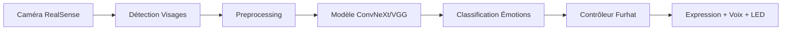

# TPE ISSD - Reconnaissance d'Expressions Faciales avec Robot Furhat

<div align="center">


**Un système de reconnaissance d'expressions faciales en temps réel intégré avec le robot humanoïde Furhat**

[🚀 Installation](#installation) • [📖 Documentation](#documentation) • [🎯 Utilisation](#utilisation) • [🤖 À propos de Furhat](#à-propos-de-furhat)

</div>

---

## 📋 Table des Matières

- [🎯 Description du Projet](#-description-du-projet)
- [✨ Fonctionnalités](#-fonctionnalités)
- [🏗️ Architecture](#️-architecture)
- [🚀 Installation](#-installation)
- [🎮 Utilisation](#-utilisation)
- [📊 Structure du Projet](#-structure-du-projet)
- [🧠 Modèles Supportés](#-modèles-supportés)
- [🤖 À propos de Furhat](#-à-propos-de-furhat)
- [🔧 Configuration Avancée](#-configuration-avancée)
- [📈 Performances](#-performances)
- [🤝 Contribution](#-contribution)

---

## 🎯 Description du Projet

Ce projet implémente un **système de reconnaissance d'expressions faciales en temps réel** utilisant des techniques de deep learning. Le système capture les expressions via une caméra Intel RealSense, les analyse avec un modèle ConvNeXt ou VGG pré-entraîné, puis fait réagir le robot humanoïde **[Furhat](https://www.furhatrobotics.com/)** en conséquence.

### 🎭 Expressions Reconnues

Le système peut détecter et réagir à **4 expressions principales** :

- 😠 **Colère** (Angry) - LED rouge, expression de colère
- 😨 **Peur** (Fear) - LED violette, expression de peur
- 😊 **Joie** (Happy) - LED jaune, grand sourire
- 😢 **Tristesse** (Sad) - LED bleue, expression triste

---

## ✨ Fonctionnalités

- 🎥 **Capture en temps réel** avec caméra Intel RealSense
- 🧠 **Deep Learning** avec modèles ConvNeXt/VGG pré-entraînés
- 🤖 **Intégration Furhat** complète (voix, expressions, LEDs)
- 🎯 **Détection de visages** avec OpenCV
- ⚡ **Traitement asynchrone** pour performances optimales
- 🎨 **Interface visuelle** avec affichage en temps réel
- 🔧 **Configuration flexible** des hyperparamètres
- 📊 **Fine-tuning** sur données personnalisées

---

## 🏗️ Architecture



**Pipeline de traitement :**

1. **Capture** : Images en temps réel via RealSense
2. **Détection** : Localisation des visages avec Haar Cascades
3. **Traitement** : Redimensionnement et augmentation des données
4. **Inférence** : Classification avec modèle pré-entraîné
5. **Réaction** : Synchronisation Furhat (expression, voix, LEDs)

---

## 🚀 Installation

### Prérequis

- 🐍 **Python 3.10+**
- 🎥 **Caméra Intel RealSense** (D415, D435, etc.)
- 🤖 **Robot Furhat** avec connexion réseau
- 💻 **Système compatible** : Linux, Windows, macOS

### 1. Installer uv (Gestionnaire de dépendances)

uv est un gestionnaire de paquets Python ultra-rapide qui gère automatiquement les environnements virtuels.

#### 🐧 Linux / 🍎 macOS

```bash
curl -LsSf https://astral.sh/uv/install.sh | sh
```

#### 🪟 Windows

```powershell
powershell -ExecutionPolicy ByPass -c "irm https://astral.sh/uv/install.ps1 | iex"
```

### 2. Cloner le Projet

```bash
git clone https://github.com/votre-username/TPE_FER_Furhat.git
cd TPE_FER_Furhat
```

### 3. Installer les Dépendances

Le choix des dépendances PyTorch dépend de votre configuration matérielle :

#### 🔥 Avec GPU NVIDIA

Identifiez d'abord votre version CUDA :

```bash
nvidia-smi
```

Puis installez selon votre version :

```bash
# CUDA 11.8
uv sync --extra cu118

# CUDA 12.4
uv sync --extra cu124

# CUDA 12.6
uv sync --extra cu126

# CUDA 12.8
uv sync --extra cu128
```

#### 💻 Autres Configurations

```bash
# CPU uniquement
uv sync --extra cpu

# GPU AMD (Linux uniquement)
uv sync --extra rocm

# GPU Intel (Linux/Windows)
uv sync --extra xpu
```

### 4. Configuration Kaggle (Optionnel)

Pour télécharger automatiquement le dataset FER2013 :

```bash
# Copier le template
cp .env.example .env

# Éditer avec vos credentials Kaggle
nano .env
```

Ajoutez vos identifiants Kaggle :

```bash
export KAGGLE_USERNAME=votre_username
export KAGGLE_KEY=votre_api_key
```

---

## 🎮 Utilisation

### 🚀 Démarrage Rapide

1. **Connecter la caméra RealSense**
2. **S'assurer que Furhat est accessible** sur le réseau
3. **Lancer l'application principale** :

```bash
uv run src/main.py
```

### 📊 Entraînement d'un Nouveau Modèle

```bash
# Entraînement initial
uv run src/train/train.py

# Fine-tuning sur vos données
uv run src/train/fine-tuning.py
```

### 🧪 Test de Modèles

```bash
# Test sur dataset
uv run src/test.py

# Test de connexion Furhat
uv run src/test_furhat.py
```

---

## 📊 Structure du Projet

```
TPE_FER_Furhat/
├── 📁 src/                     # Code source principal
│   ├── 🐍 main.py             # Application principale
│   ├── 🧪 test.py             # Tests de modèles
│   ├── 🤖 test_furhat.py      # Test connexion Furhat
│   └── 📁 train/              # Scripts d'entraînement
│       ├── 🔧 utils.py        # Utilitaires ML
│       ├── 🎯 train.py        # Entraînement initial
│       └── ⚡ fine-tuning.py  # Fine-tuning
├── 📁 trained/                # Modèles sauvegardés (auto-généré)
├── 📁 dataset/                # Dataset local (auto-téléchargé)
├── ⚙️ pyproject.toml          # Configuration projet
├── 🔒 .env.example            # Template variables environnement
└── 📖 README.md               # Ce fichier
```

### 🧩 Composants Principaux

#### `src/main.py` - Application Principale

- **FurhatController** : Gestion robot (voix, expressions, LEDs)
- **InMemoryFaceDataset** : Dataset optimisé pour l'inférence
- **Pipeline temps réel** : Capture → Traitement → Inférence → Réaction

#### `src/train/utils.py` - Utilitaires ML

- [`get_model()`](src/train/utils.py) : Factory de modèles (VGG/ConvNeXt)
- [`get_data_transforms()`](src/train/utils.py) : Pipeline de preprocessing
- [`train_classifier_with_validation()`](src/train/utils.py) : Boucle d'entraînement
- [`eval_classifier()`](src/train/utils.py) : Évaluation de performance

---

## 🧠 Modèles Supportés

### 🏗️ Architectures

| Modèle       | Variantes                  | Paramètres  | Performance |
| ------------ | -------------------------- | ----------- | ----------- |
| **ConvNeXt** | Tiny, Small, Base, Large   | 28M - 197M  | ⭐⭐⭐⭐⭐  |
| **VGG**      | VGG11, VGG13, VGG16, VGG19 | 132M - 143M | ⭐⭐⭐⭐    |

### ⚙️ Configuration Recommandée

```python
MODEL_NAME = "convnext"
MODEL_VERSION = "large"        # Meilleure précision
UNFREEZE_LAYER = 3            # Fine-tuning optimal
BATCH_SIZE = 32               # Équilibre vitesse/mémoire
```

---

## 🤖 À propos de Furhat

[Furhat Robotics](https://www.furhatrobotics.com/) développe des robots sociaux avec des capacités d'interaction naturelle. Notre système utilise :

### 🎭 Capacités Furhat Utilisées

- **Expressions faciales** : 20+ expressions programmables
- **Synthèse vocale** : Voix multilingues (français supporté)
- **LEDs** : Éclairage RGB personnalisable
- **API REST** : Contrôle via HTTP/WebSocket

### 🔧 Configuration Réseau

Par défaut, le système cherche Furhat sur `192.168.10.14:54321`. Modifiez dans `main.py` :

```python
furhat_controller = FurhatController(host="VOTRE_IP_FURHAT")
```

---

## 🔧 Configuration Avancée

### 🎯 Hyperparamètres d'Entraînement

```python
# Dans train.py ou fine-tuning.py
EMOTIONS_TO_EXCLUDE = ["surprise", "neutral", "disgust"]
AUGMENTATION_LEVEL = "heavy"    # none, light, medium, heavy
BATCH_SIZE = 256               # Ajuster selon GPU
EPOCHS = 15                    # Nombre d'époques
LR = 1e-4                      # Taux d'apprentissage
```

### 🎥 Paramètres Caméra

```python
# Dans main.py
NUM_IMAGES = 60               # Images par batch d'inférence
cfg.enable_stream(rs.stream.color, 640, 480, rs.format.bgr8, 60)
```

### 🤖 Personnalisation Furhat

```python
# Messages par émotion (dans FurhatController)
self.messages = {
    "happy": ["Je suis heureux!", "Quelle joie!"],
    "sad": ["Je me sens triste...", "La mélancolie me gagne."]
}

# Couleurs LED personnalisées
self.colors = {
    "happy": {"r": 255, "g": 255, "b": 0},  # Jaune
    "angry": {"r": 255, "g": 0, "b": 0}     # Rouge
}
```

---

## 📈 Performances

### 🎯 Métriques Typiques

| Dataset                     | Modèle         | Précision |
| --------------------------- | -------------- | --------- |
| FER2013                     | ConvNeXt-Large | ~60%      |
| Fine-tuné sur notre dataset | ConvNeXt-Large | ~90%      |
